> [!NOTE]
> Download XAMPP dulu dari https://www.apachefriends.org/download.html kalo belum ada XAMPP

## Masuk kebagian explorer untuk masuk ke folder xampp

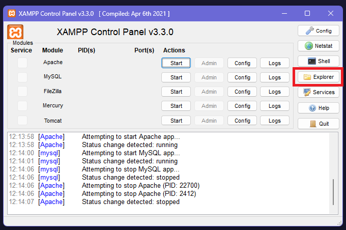

## Buka folder `htdocs` dan copy folder `tutor` ke dalam folder `htdocs`

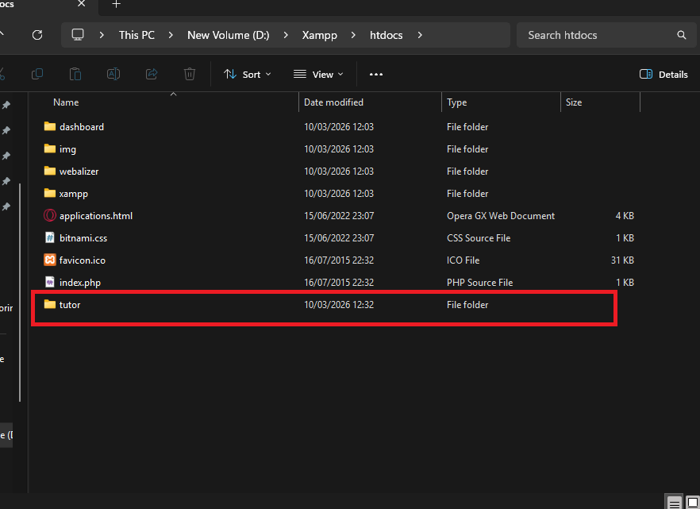

## Nyalakan XAMPP dan start Apache

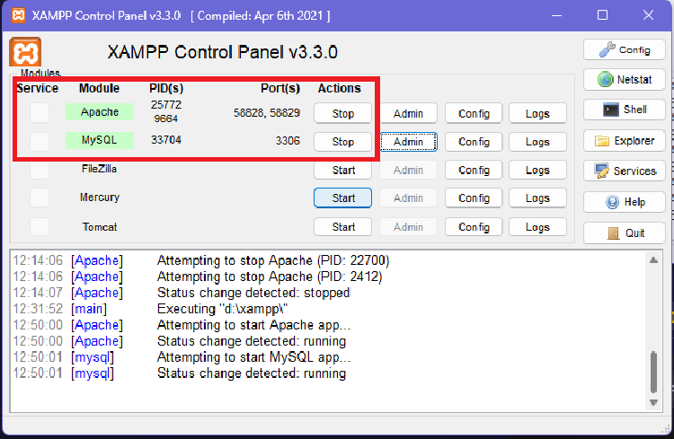

## Masuk ke admin phpmyadmin

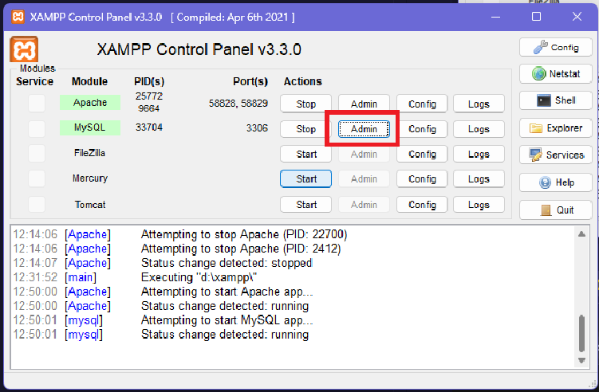

## Buat database baru dengan nama `sistem_mahasiswa`

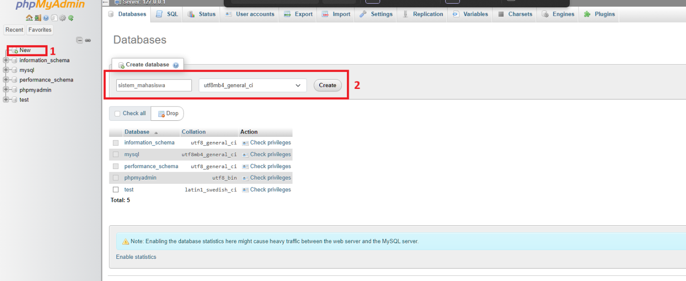

## Buat table dengan nama `pengguna` dengan jumlah kolom 5

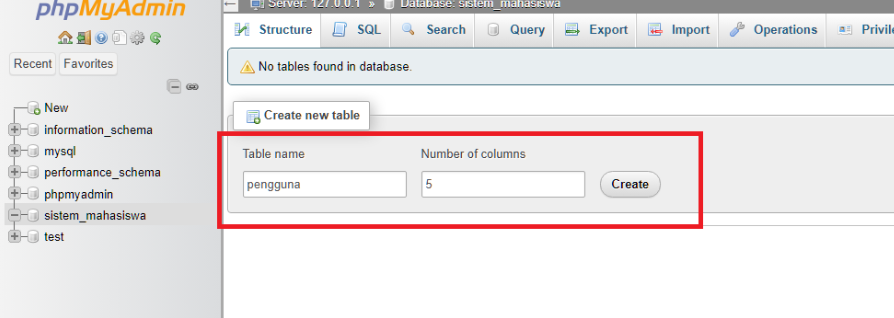

## Buat kolom sebagai berikut:

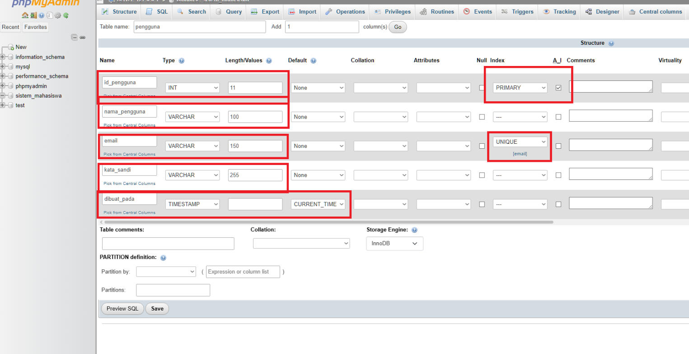

```sql
id_pengguna     INT(11) AUTO_INCREMENT PRIMARY KEY,
nama_pengguna   VARCHAR(100) NOT NULL,
email           VARCHAR(150) NOT NULL UNIQUE,
kata_sandi      VARCHAR(255) NOT NULL,
dibuat_pada     TIMESTAMP DEFAULT CURRENT_TIMESTAMP
```

> [!IMPORTANT]
> Ketika mengubah index menjadi unique, akan muncul tampilan ini, cukup tekan `Go`
> 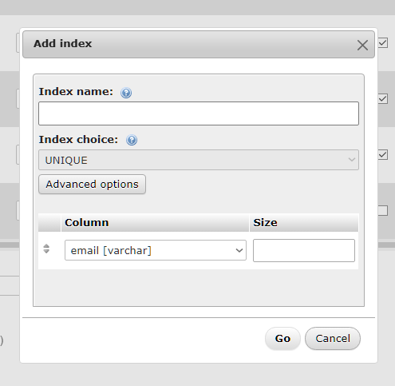

## Buat table dengan nama `mahasiswa` dengan jumlah kolom 12

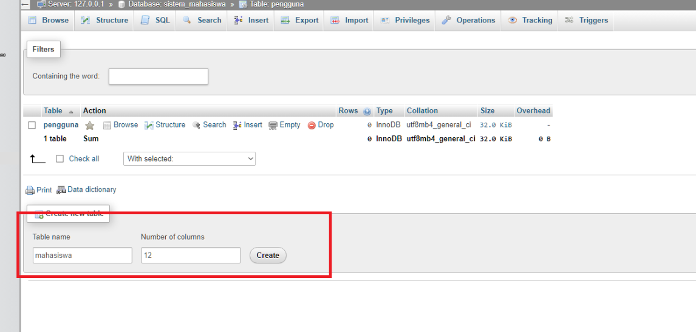

## Buat kolom sebagai berikut:

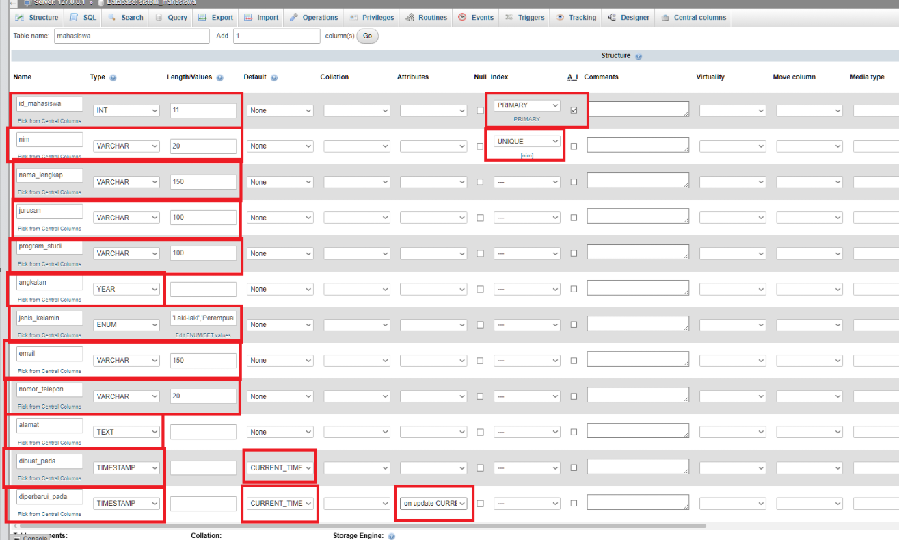

```sql
id_mahasiswa    INT(11) AUTO_INCREMENT PRIMARY KEY,
nim             VARCHAR(20) NOT NULL UNIQUE,  -- Nomor Induk Mahasiswa
nama_lengkap    VARCHAR(150) NOT NULL,
jurusan         VARCHAR(100) NOT NULL,
program_studi   VARCHAR(100) NOT NULL,
angkatan        YEAR NOT NULL,
jenis_kelamin   ENUM('Laki-laki', 'Perempuan') NOT NULL,
email           VARCHAR(150),
nomor_telepon   VARCHAR(20),
alamat          TEXT,
dibuat_pada     TIMESTAMP DEFAULT CURRENT_TIMESTAMP,
diperbarui_pada TIMESTAMP DEFAULT CURRENT_TIMESTAMP ON UPDATECURRENT_TIMESTAMP
```

> [!IMPORTANT]
> Saat menambahkan enum untuk kolom `jenis_kelamin`, pastikan untuk menambahkan nilai enum `Laki-laki` dan `Perempuan`, untuk membuka menunya, tekan

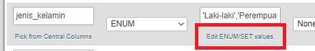

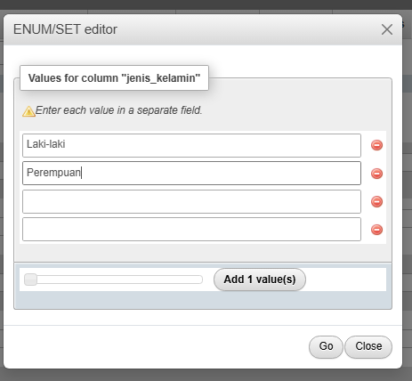

## Jadi kolom kolom nya begini

### Kolom mahasiswa

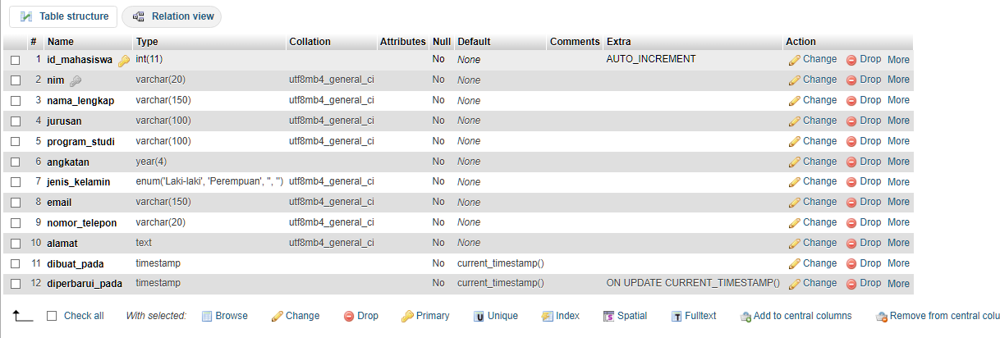

### Kolom pengguna

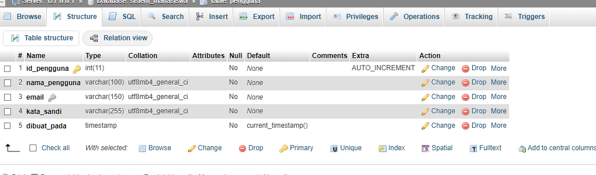

## Kembali ke folder `tutor` dan tekan pada bagian ini

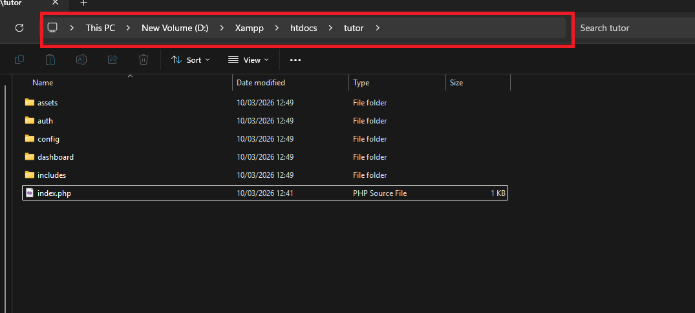

> [!CAUTION]
> Tekan pada bagian kosong, jangan pada tulisan
> 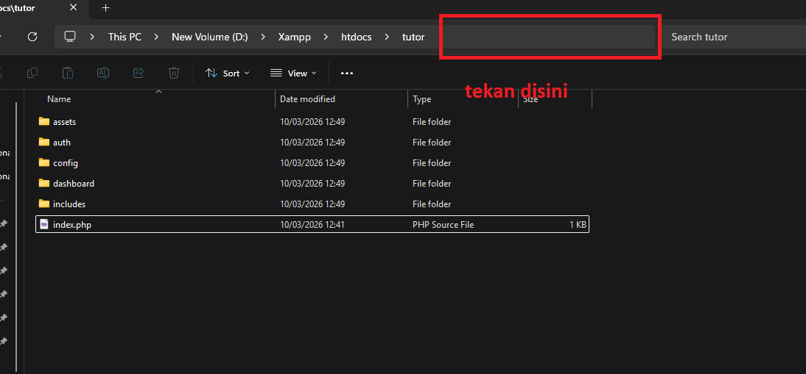

## Ketik `cmd` lalu tekan enter

## Command prompt akan terbuka lalu ketik `code .` lalu tekan enter untuk membuka folder `tutor` di Visual Studio Code

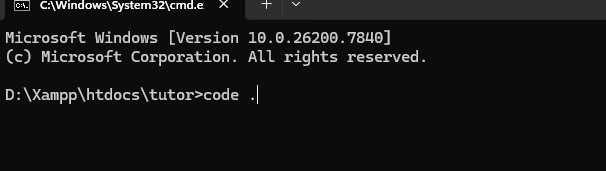

## Oh ya, untuk membuka website nya, ketik `localhost/tutor/index.php` di browser

# Lanjut ke file `index.php` ya, nanti akan ada gambar di setiap folder, untuk ngejelasin gimana cara kerja nya

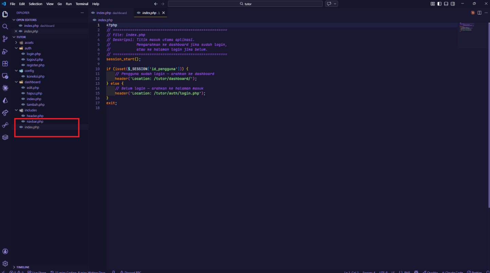
